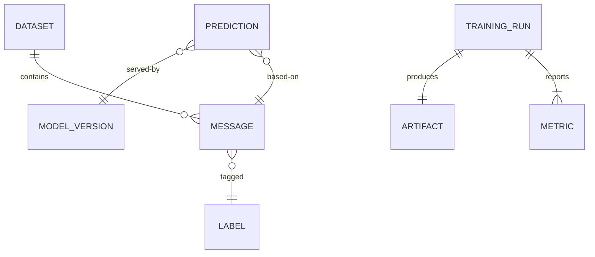

# Schema — Smart-Spam-Detector: Data Model & Database Design

| Field | Value |
|---|---|
| Version | v0.1 |
| Last Updated | 2026-08-06 |
| Owner | Data Engineer |
| Status | In Review |

---

## 1. ER Diagram



> Note: v1 is file/artifact-based (CSV datasets, `.pkl`/`.joblib` artifacts, JSON metrics). Relational tables below define the logical model for tooling that reads/writes these files and for optional history storage (REQ-023).

## 2. Table/Collection Definitions

### TBL-dataset

| Field | Type | Nullable | Default | Constraints | Description |
|---|---|---|---|---|---|
| id | UUID | N | — | PK | Dataset identifier |
| name | string | N | — | unique | Dataset name |
| source | string | Y | null | — | Origin (URL/file) |
| license | string | Y | null | — | License identifier |
| version | string | N | "1.0.0" | — | Dataset version |
| created_at | datetime | N | now() | — | Ingestion timestamp |

### TBL-message

| Field | Type | Nullable | Default | Constraints | Description |
|---|---|---|---|---|---|
| id | UUID | N | — | PK | Message identifier |
| dataset_id | UUID | N | — | FK → TBL-dataset | Owning dataset |
| text | text | N | — | len ≤ 10,000 | Raw message body |
| label | string | N | — | FK → TBL-label | Spam/ham/unknown |
| hash | string | N | — | unique | SHA-256 dedupe key |
| cleaned_text | text | Y | null | — | Normalized text |

### TBL-label

| Field | Type | Nullable | Default | Constraints | Description |
|---|---|---|---|---|---|
| id | string | N | — | PK | "spam" / "ham" / "unknown" |
| display_name | string | N | — | — | Human label |

### TBL-training_run

| Field | Type | Nullable | Default | Constraints | Description |
|---|---|---|---|---|---|
| id | UUID | N | — | PK | Run identifier |
| dataset_id | UUID | N | — | FK → TBL-dataset | Source data |
| seed | int | N | 42 | — | Reproducibility seed |
| model_class | string | N | — | — | Classifier name |
| started_at | datetime | N | now() | — | Start time |
| finished_at | datetime | Y | null | — | End time |
| status | string | N | "pending" | enum | pending/running/succeeded/failed |

### TBL-metric

| Field | Type | Nullable | Default | Constraints | Description |
|---|---|---|---|---|---|
| id | UUID | N | — | PK | Metric identifier |
| run_id | UUID | N | — | FK → TBL-training_run | Owning run |
| name | string | N | — | — | f1/precision/recall/accuracy |
| value | float | N | — | 0..1 | Metric value |
| split | string | N | "test" | enum | train/val/test |

### TBL-artifact

| Field | Type | Nullable | Default | Constraints | Description |
|---|---|---|---|---|---|
| id | UUID | N | — | PK | Artifact identifier |
| run_id | UUID | N | — | FK → TBL-training_run | Producing run |
| kind | string | N | — | enum | vectorizer/model/metrics |
| path | string | N | — | — | Artifact file path |
| version | string | N | — | semver | Artifact version |
| sha256 | string | N | — | — | Integrity hash |

### TBL-model_version

| Field | Type | Nullable | Default | Constraints | Description |
|---|---|---|---|---|---|
| id | string | N | — | PK | Model version tag |
| artifact_id | UUID | N | — | FK → TBL-artifact | Primary artifact |
| status | string | N | "staging" | enum | staging/live/retired |
| promoted_at | datetime | Y | null | — | When live |

### TBL-prediction

| Field | Type | Nullable | Default | Constraints | Description |
|---|---|---|---|---|---|
| id | UUID | N | — | PK | Prediction identifier |
| message_id | UUID | Y | null | FK → TBL-message | Source message (if persisted) |
| text | text | N | — | — | Input text |
| label | string | N | — | — | Predicted label |
| score | float | N | — | 0..1 | Confidence |
| model_version | string | N | — | FK → TBL-model_version | Serving version |
| latency_ms | int | N | — | ≥ 0 | Inference time |
| created_at | datetime | N | now() | — | Timestamp |

## 3. Relationships & Foreign Keys

| From | To | Type | On Delete | Justification |
|---|---|---|---|---|
| TBL-message.dataset_id | TBL-dataset | N:1 | Restrict | Never orphan training rows |
| TBL-message.label | TBL-label | N:1 | Restrict | Enforce valid labels |
| TBL-metric.run_id | TBL-training_run | N:1 | Cascade | Metrics die with run |
| TBL-artifact.run_id | TBL-training_run | N:1 | Cascade | Artifacts die with run |
| TBL-model_version.artifact_id | TBL-artifact | N:1 | Restrict | Version must resolve |
| TBL-prediction.message_id | TBL-message | N:1 | Set null | Keep history if source removed |

## 4. Indexes

| Table | Index | Columns | Type | Reason |
|---|---|---|---|---|
| TBL-message | ix_msg_hash | hash | unique | Dedupe lookups |
| TBL-message | ix_msg_dataset | dataset_id | btree | Per-dataset splits |
| TBL-metric | ix_metric_run | run_id, name | composite | Metrics retrieval |
| TBL-prediction | ix_pred_time | created_at | btree | History queries |

## 5. Enums / Constants

| Field | Allowed Values |
|---|---|
| label | spam, ham, unknown |
| run.status | pending, running, succeeded, failed |
| metric.split | train, val, test |
| artifact.kind | vectorizer, model, metrics |
| model_version.status | staging, live, retired |

## 6. Data Lifecycle

- **Retention:** predictions history retained 90 days (configurable); raw datasets retained indefinitely with license metadata.
- **Deletion:** soft-delete datasets (keep id, null text) unless compliance requires hard delete.
- **Archival:** metrics JSON and artifacts archived per run; old models retired but never deleted (auditability).

## 7. Migrations Strategy

- Tool: lightweight Python migration scripts (`migrations/`) run by CLI; no ORM required in v1.
- Naming: `0001_short_description.py`, sequential.
- Rollback: each script has `up()`/`down()`; down is best-effort and logged.

## 8. Sample Records

```json
{
  "dataset": { "id": "d1", "name": "sms-spam-v1", "license": "CC-BY-4.0" },
  "message": { "id": "m1", "text": "WINNER! Claim your free prize now", "label": "spam", "hash": "a3f9..." },
  "training_run": { "id": "r1", "seed": 42, "status": "succeeded" },
  "metric": { "run_id": "r1", "name": "f1", "value": 0.984, "split": "test" },
  "prediction": { "id": "p1", "text": "WINNER! Claim your free prize now", "label": "spam", "score": 0.991, "latency_ms": 12 }
}
```

## 9. Data Validation Rules

| Field | Enforced In | Rule |
|---|---|---|
| message.text | App + DB | Non-empty, ≤ 10,000 chars |
| label | DB | Must exist in TBL-label |
| metric.value | App | 0 ≤ v ≤ 1 |
| artifact.sha256 | App | 64-char hex |
| prediction.score | App | 0 ≤ v ≤ 1 |

## 10. Sensitive Data Map

| Field | Sensitivity | Encryption at Rest | Masking in Logs |
|---|---|---|---|
| message.text | PII (possible) | Optional (volume encryption) | Truncate to 100 chars in logs |
| prediction.text | PII (possible) | Optional | Truncate in logs |
| Everything else | None | N/A | N/A |

## 11. Related Documents

| Document | Relationship |
|---|---|
| TechSpec.md | Storage/artifact implementation |
| API.md | Endpoints touching prediction history |
| SecurityAndCompliance.md | PII handling rules |
| PRD.md | REQ-011 dataset lifecycle |
