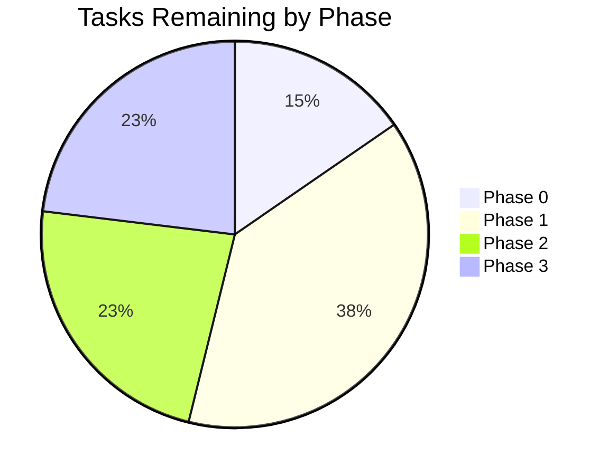

# Tracker — Smart-Spam-Detector: Living Status Tracker

| Field | Value |
|---|---|
| Version | v0.1 |
| Last Updated | 2026-08-06 |
| Owner | Tech Lead |
| Status | Active |

---

## 1. Snapshot Dashboard

| Metric | Value |
|---|---|
| Overall % Complete | 0% |
| Current Phase | Phase 0 — Foundation |
| Tasks Done / Total | 0 / 11 |
| Blockers (open) | 0 |
| Days to Target Launch | 45 |

## 2. Status Legend

🟢 Done | 🟡 In Progress | 🔴 Blocked | ⚪ Not Started | 🔵 In Review

## 3. Phase Progress Bars

| Phase | Progress |
|---|---|
| Phase 0 — Foundation | [░░░░░░░░░░] 0% |
| Phase 1 — Core MVP | [░░░░░░░░░░] 0% |
| Phase 2 — Polish | [░░░░░░░░░░] 0% |
| Phase 3 — Scale-ready | [░░░░░░░░░░] 0% |

## 4. Full Task Table

| TASK | Description | Status | Assignee | Start | Target | Actual | Notes |
|---|---|---|---|---|---|---|---|
| TASK-0.1 | Pin deps + pre-commit | ⚪ | Eng | — | 2026-08-14 | — | — |
| TASK-0.2 | CI workflow | ⚪ | DevOps | — | 2026-08-18 | — | — |
| TASK-1.1 | Dataset loader + cleaning | ⚪ | DS | — | 2026-08-28 | — | — |
| TASK-1.2 | TF-IDF + classifier training | ⚪ | DS | — | 2026-09-01 | — | — |
| TASK-1.3 | Artifact export | ⚪ | DS | — | 2026-09-02 | — | — |
| TASK-1.4 | `/predict` endpoint | ⚪ | Eng | — | 2026-09-04 | — | — |
| TASK-1.5 | Streamlit classify UI | ⚪ | FE | — | 2026-09-09 | — | — |
| TASK-2.1 | `/predict-batch` | ⚪ | Eng | — | 2026-09-14 | — | — |
| TASK-2.2 | Explainability tokens | ⚪ | DS | — | 2026-09-14 | — | — |
| TASK-2.3 | History UI | ⚪ | FE | — | 2026-09-16 | — | — |
| TASK-3.1 | Logs + /health | ⚪ | DevOps | — | 2026-09-25 | — | — |
| TASK-3.2 | Rate limiting + API keys | ⚪ | Sec | — | 2026-09-29 | — | — |
| TASK-3.3 | Load test | ⚪ | DevOps | — | 2026-10-02 | — | — |

## 5. Blockers Log

| ID | Description | Raised | Owner | Impact | Status |
|---|---|---|---|---|---|
| — | None | — | — | — | — |

## 6. Changelog

- 2026-08-06: Documentation suite generated (14 files in project-docs/).

## 7. Burndown Summary

## 8. Next 3 Priorities

1. TASK-0.1 — pin dependencies and pre-commit hooks.
2. TASK-1.1 — dataset loader with dedupe + split.
3. TASK-1.2 — reproducible TF-IDF + classifier training.

## 9. Related Documents

| Document | Relationship |
|---|---|
| ImplementationPlan.md | Source of every task above |
| PRD.md | Feature priorities to unblock |
| RiskRegister.md | Open risks affecting schedule |
