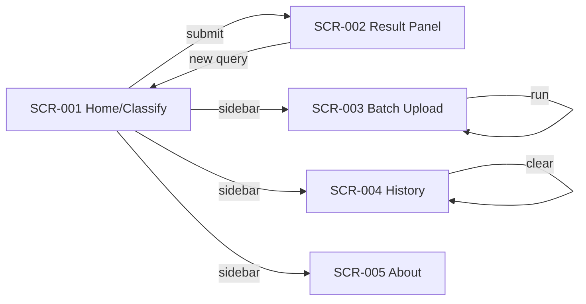
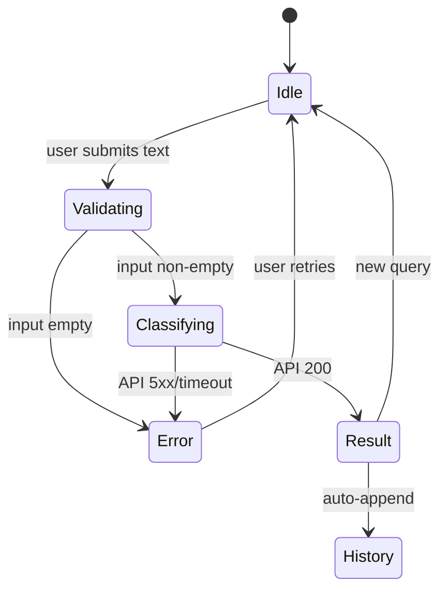
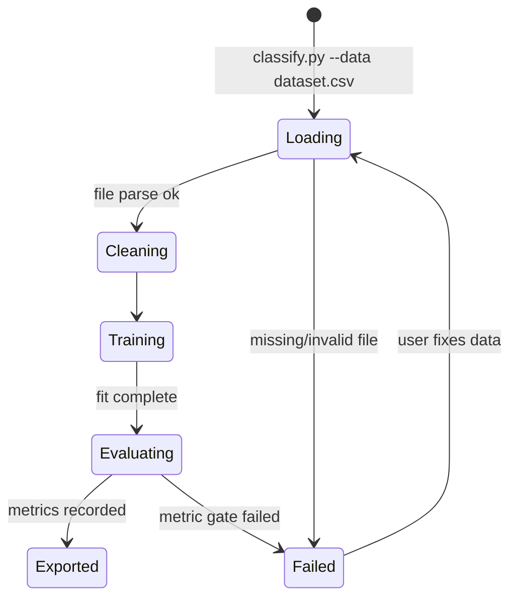

# AppFlow — Smart-Spam-Detector: Application Flow

|Field|Value|
|---|---|
|Version|v0.1|
|Last Updated|2026-08-06|
|Owner|Product Designer|
|Status|In Review|

---

## 1. Screen Inventory

|ID|Screen Name|Purpose|Entry Points|Exit Points|Auth Required|
|---|---|---|---|---|---|
|SCR-001|Home / Classify|Paste message, get verdict|App root|Submit / clear / history|N|
|SCR-002|Result Panel|Show label, score, top tokens|After submit|New query / copy result|N|
|SCR-003|Batch Upload|Upload CSV/JSON for bulk classify|Sidebar link|Run batch / download results|N|
|SCR-004|History|View past classifications (in-session)|Sidebar link|Clear / delete item|N|
|SCR-005|About / Model Info|Model version, metrics, dataset info|Sidebar link|Back|N|

## 2. Navigation Map

## 3. Detailed Flow per Journey

### 3.1 Classification Journey

### 3.2 Training Journey (CLI, no UI)

## 4. Empty / Loading / Error States

|Screen|Empty|Loading|Error|
|---|---|---|---|
|SCR-001|Placeholder hint text|Spinner while calling API|Banner: "Could not reach API" + retry|
|SCR-002|Not applicable (only after submit)|Spinner|Error detail + copy of message preserved|
|SCR-003|"No file chosen"|Progress bar per row|Row-level errors listed with line numbers|
|SCR-004|"No classifications yet"|Skeleton rows|Inline message with retry|
|SCR-005|N/A (static)|N/A|N/A|

## 5. Edge Cases & Branching Logic

|IF condition|THEN route|
|---|---|
|Message length > 10,000 chars|Reject with E400_INVALID_INPUT|
|Empty / whitespace-only message|Reject with validation hint|
|API returns score near 0.5|Show "uncertain" styling + top tokens emphasis|
|Batch file with malformed rows|Skip row, record error, continue others|
|Model artifact missing|`/health` degraded; UI shows maintenance banner|

## 6. Notifications & Re-engagement Flows

- No push/email notifications in v1.
- In-app: success toasts after batch completion; error toasts on failures.

## 7. Cross-Platform Deltas

- Web-only in v1 (Streamlit). API is platform-agnostic; mobile apps can consume it directly.
- No desktop/mobile native clients planned for v1.

## 8. Related Documents

|Document|Relationship|
|---|---|
|[PRD.md](../product/PRD.md)|User stories behind each screen|
|[Design.md](Design.md)|Components used by SCR-001..005|
|[API.md](../technical/API.md)|Endpoints backing these flows|
|[TechSpec.md](../technical/TechSpec.md)|Architecture implementing the flows|
|[Schema.md](../technical/Schema.md)|History record model|
