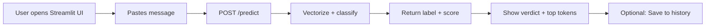

# PRD — Smart-Spam-Detector: ML-Powered SMS/Email Spam Classifier

|Field|Value|
|---|---|
|Version|v0.1|
|Last Updated|2026-08-06|
|Owner|Product Manager|
|Status|In Review|

---

## 1. Executive Summary

Smart-Spam-Detector is a production-grade machine-learning application that classifies SMS and email messages as spam or ham (legitimate) with high precision. It exposes a REST API (`api.py`) and a web UI (`app.py`, Streamlit) for interactive classification, is trained on curated message datasets, and ships with reproducible training, evaluation, and deployment tooling (Docker, docker-compose, CI-friendly linting). The goal is to deliver a trustworthy, explainable, and self-hostable spam-filtering service that individuals and small teams can deploy in minutes.

## 2. Problem Statement

- **User pain:** Unsolicited and fraudulent messages (phishing, scams, promotions) waste time and expose users to financial and privacy harm. Generic filters are opaque and hard to self-host.
- **Evidence/context:** SMS phishing ("smishing") and email spam volumes continue to rise; off-the-shelf filters are black boxes owned by third parties.
- **Cost of not solving it:** Users continue to be phished; developers wanting a transparent, own-your-data filter must build one from scratch.

## 3. Goals & Non-Goals

|Goal|Metric|Target|
|---|---|---|
|High classification accuracy|F1 score on holdout test set|≥ 0.97|
|Low false-positive rate (ham flagged as spam)|False-positive rate|< 1%|
|Fast inference|p95 API latency (single message)|< 200 ms|
|Reproducible training|Deterministic pipeline via seed + pinned deps|100% reproducible runs|
|Easy self-hosting|Time from clone to running service|< 15 minutes|

**Non-Goals (v1):**

- No real-time streaming of bulk message feeds (batch/inference API only).
- No multi-tenant user accounts or billing.
- No browser-extension delivery.
- No multilingual model training (v1 is English-focused; see REQ-013).

## 4. Target Users & Personas

|Persona|Role|Goals|Frustrations|Quote|Tech Level|
|---|---|---|---|---|---|
|Priya — Privacy-conscious individual|Personal user|Filter spam without sending messages to cloud|Mistrusts third-party filters with private data|"I want my messages to stay on my machine."|Medium|
|Dev — Integration engineer|Developer at a startup|Embed spam filtering into their product via API|Opaque APIs with no cost control|"I need a self-hosted classifier with a clean API."|High|
|Sam — Security researcher|Analyst|Detect phishing campaigns in datasets|Generic models with no metrics/reproducibility|"I need to see precision and recall per run."|High|

## 5. User Stories

|ID|As a...|I want...|So that...|Priority|Acceptance Criteria|
|---|---|---|---|---|---|
|US-001|Privacy-conscious individual|To paste a message into a web form and get a spam/ham verdict|I can screen messages locally|P0|Streamlit app returns label + confidence < 1 s|
|US-002|Integration engineer|To POST a message to `/predict` and get JSON|I can wire filtering into my app|P0|API returns `{label, score}`; documented in ../technical/API.md|
|US-003|Integration engineer|To classify many messages at once|I can batch-process queues|P1|Batch endpoint accepts list, returns list|
|US-004|Security researcher|To retrain the model on my own data|I can tune for my domain|P1|CLI training script runs end-to-end with a CSV|
|US-005|All|To see why a message was flagged|I can trust the verdict|P1|Prediction response includes top contributing tokens|

## 6. Feature List

**Epic: Classification Core**

|ID|Feature|Description|Priority|Status|
|---|---|---|---|---|
|REQ-001|Single-message prediction|REST endpoint + UI for one message|P0|Planned|
|REQ-002|Batch prediction|REST endpoint for lists of messages|P1|Planned|
|REQ-003|Confidence score|Probability output alongside label|P0|Planned|
|REQ-004|Explainability tokens|Top weighted terms per prediction|P1|Planned|

**Epic: Model & Data**

|ID|Feature|Description|Priority|Status|
|---|---|---|---|---|
|REQ-010|Training pipeline|Scripted train/validate/test with metrics|P0|Planned|
|REQ-011|Dataset loading & cleaning|Support CSV datasets, dedupe, label mapping|P0|Planned|
|REQ-012|Model export|Save vectorizer + model artifacts for serving|P0|Planned|
|REQ-013|English-only v1|Documented scope; multilingual deferred|P2|Planned|

**Epic: Platform & Ops**

|ID|Feature|Description|Priority|Status|
|---|---|---|---|---|
|REQ-020|REST API server|FastAPI service (`api.py`)|P0|Planned|
|REQ-021|Web UI|Streamlit app (`app.py`)|P1|Planned|
|REQ-022|Containerization|Dockerfile + compose profiles|P1|Planned|
|REQ-023|Observability|Structured logs + request metrics|P2|Planned|

## 7. User Journeys (high level)

## 8. Success Metrics / KPIs

|Metric|Target|Measurement Method|
|---|---|---|
|North star: trust in verdicts|F1 ≥ 0.97 on holdout|Holdout evaluation at each training run|
|False positives|< 1%|Confusion matrix on test set|
|API availability|99.5% monthly|Uptime checks / request logs|
|p95 latency|< 200 ms|API access logs|

## 9. Assumptions & Dependencies

- Datasets used are publicly available or user-supplied; license compliance is checked at ingestion.
- Model is trained offline; the serving process only loads artifacts (no runtime training).
- Deployment targets: Docker-compatible hosts (self-host, VPS, container platforms).
- Python 3.9+ environment with pinned dependencies (see `requirements.txt`).

## 10. Risks

Top risks summarized from ../project/RiskRegister.md:

1. **Data poisoning / skew (R-03):** Low-quality training data degrades accuracy — mitigate with validation gates in the pipeline.
2. **Model drift (R-04):** Spam evolves — mitigate with periodic retraining cadence and drift monitoring.
3. **Abuse of open API (R-07):** Unauthenticated endpoints can be abused — mitigate with rate limiting and optional API keys.

## 11. Release Criteria (v1 done)

- [ ] Test set F1 ≥ 0.97 and false-positive rate < 1%
- [ ] `/predict` and `/predict-batch` live behind versioned API
- [ ] Streamlit UI classifies a message end-to-end
- [ ] Docker image builds and `docker compose up` serves API + UI
- [ ] Reproducible training: same inputs → same metrics (seed pinned)
- [ ] ../technical/API.md, ../technical/Testing.md, ../technical/Deployment.md in sync with implementation

## 12. Open Questions

|#|Question|Owner|Resolve By|
|---|---|---|---|
|OQ-01|Which dataset license is acceptable for production retraining?|PM|Milestone M2|
|OQ-02|Should batch endpoint accept CSV uploads or JSON only?|Eng|Milestone M1|

## 13. Related Documents

|Document|Relationship|
|---|---|
|[TechSpec.md](../technical/TechSpec.md)|Architecture and stack for the classifier and API|
|[AppFlow.md](../design/AppFlow.md)|Screens and user journeys for UI + API flows|
|[Design.md](../design/Design.md)|Visual system for the Streamlit UI|
|[Schema.md](../technical/Schema.md)|Data model for datasets, artifacts, and history|
|[ImplementationPlan.md](../project/ImplementationPlan.md)|Phased build plan mapping to REQ IDs|
|[Tracker.md](../project/Tracker.md)|Live status of every feature/task|
|[Rules.md](../project/Rules.md)|Coding standards and AI-agent operating rules|
|[API.md](../technical/API.md)|Every endpoint contract|
|[SecurityAndCompliance.md](../technical/SecurityAndCompliance.md)|Threat model and data protection|
|[Testing.md](../technical/Testing.md)|Test strategy and coverage targets|
|[Deployment.md](../technical/Deployment.md)|Environments and CI/CD|
|[Glossary.md](../reference/Glossary.md)|Shared vocabulary|
|[RiskRegister.md](../project/RiskRegister.md)|Full risk register|
