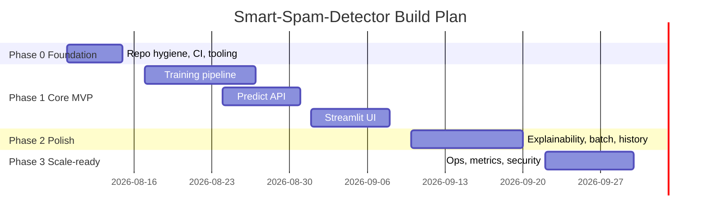
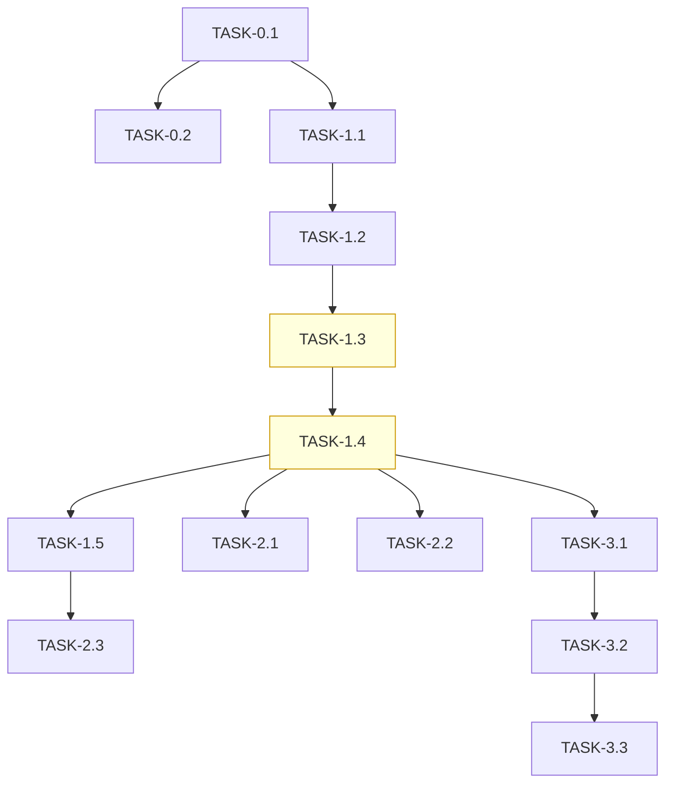

# ImplementationPlan — Smart-Spam-Detector: Phased Build Plan

| Field | Value |
| --- | --- |
| Version | v0.1 |
| Last Updated | 2026-08-06 |
| Owner | Tech Lead |
| Status | In Review |

---

## 1. Build Philosophy

Walking skeleton first: get a trainable pipeline → API → UI slice working end-to-end in Phase 0/1, then harden metrics, explainability, and ops. Vertical slices per feature; ship continuously.

## 2. Phase Overview

## 3. Phase Breakdown

### Phase 0 — Foundation

**Goal:** Reproducible dev environment and CI gates.

**Entry criteria:** Repo cloned, Python 3.9+ available. **Exit criteria:** `make lint && make test` green on CI.

| TASK | Description | Depends on | Owner | Effort | Maps to |
| --- | --- | --- | --- | --- | --- |
| TASK-0.1 | Pin deps (requirements.txt) + pre-commit | — | Eng | 1d | REQ-022 |
| TASK-0.2 | CI workflow (lint, test, build image) | TASK-0.1 | DevOps | 2d | REQ-022 |

### Phase 1 — Core MVP

**Goal:** Train, serve, and classify a single message.

| TASK | Description | Depends on | Owner | Effort | Maps to |
| --- | --- | --- | --- | --- | --- |
| TASK-1.1 | Dataset loader + cleaning + split | TASK-0.1 | DS | 3d | REQ-010, REQ-011 |
| TASK-1.2 | TF-IDF + classifier training with seed | TASK-1.1 | DS | 3d | REQ-010 |
| TASK-1.3 | Artifact export (vectorizer + model + metrics) | TASK-1.2 | DS | 1d | REQ-012 |
| TASK-1.4 | FastAPI `/predict` endpoint | TASK-1.3 | Eng | 2d | REQ-001, REQ-003, REQ-020 |
| TASK-1.5 | Streamlit classify UI | TASK-1.4 | FE | 3d | REQ-021, US-001 |

### Phase 2 — Polish

**Goal:** Batch, explainability, history.

| TASK | Description | Depends on | Owner | Effort | Maps to |
| --- | --- | --- | --- | --- | --- |
| TASK-2.1 | `/predict-batch` endpoint | TASK-1.4 | Eng | 2d | REQ-002 |
| TASK-2.2 | Top-tokens explainability | TASK-1.4 | DS | 2d | REQ-004 |
| TASK-2.3 | In-session history UI | TASK-1.5 | FE | 2d | US-005, SCR-004 |

### Phase 3 — Scale-readiness

**Goal:** Ops hardening.

| TASK | Description | Depends on | Owner | Effort | Maps to |
| --- | --- | --- | --- | --- | --- |
| TASK-3.1 | Structured logs + /health | TASK-1.4 | DevOps | 2d | REQ-023 |
| TASK-3.2 | Rate limiting + optional API keys | TASK-3.1 | Sec | 2d | R-07 |
| TASK-3.3 | Load test and perf budget check | TASK-3.2 | DevOps | 2d | NFR-01 |

## 4. Dependency Graph

## 5. Environment & Tooling Setup Checklist

- [ ] Clone repo; create venv (Python 3.9+)
- [ ] `pip install -r requirements.txt`
- [ ] Install pre-commit hooks (`pre-commit install`)
- [ ] Verify `make lint`, `make test`, `make train` work
- [ ] Confirm `.env.example` → `.env` (no secrets required for v1)

## 6. Rollout Strategy

- Model versioning: staging → live promotion after metric gate.
- Feature flags: `EXPLAINABILITY_ENABLED`, `BATCH_ENABLED` env flags.
- Canary: serve new model to 10% of requests, compare FPR.

## 7. Definition of Done (global)

- [ ] Tests written and passing (unit + API contract)
- [ ] Lint/format clean (ruff)
- [ ] Docs updated if behavior changed (Schema.md/../technical/API.md)
- [ ] Accessibility checked for UI tasks
- [ ] PR < 400 lines unless justified
- [ ] Tracker.md updated

## 8. Related Documents

| Document | Relationship |
| --- | --- |
| [PRD.md](../product/PRD.md) | REQ IDs traced above |
| [TechSpec.md](../technical/TechSpec.md) | Component responsibilities |
| [AppFlow.md](../design/AppFlow.md) | SCR IDs traced above |
| [Schema.md](../technical/Schema.md) | TBL IDs traced above |
| [Tracker.md](Tracker.md) | Live status of these tasks |
