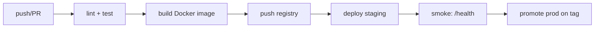
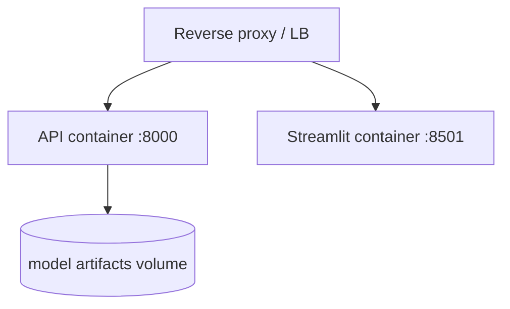

# Deployment — Smart-Spam-Detector: Deployment Guide

| Field | Value |
| --- | --- |
| Version | v0.1 |
| Last Updated | 2026-08-06 |
| Owner | DevOps Engineer |
| Status | In Review |

---

## 1. CI/CD Pipeline

## 2. Environment Promotion Flow

| Stage | Trigger | Verification |
| --- | --- | --- |
| Dev | manual | local run |
| Staging | merge to main | /health + sample predictions |
| Prod | git tag `v*` | metrics gate + canary 10% |

## 3. Deployment Topology

- Single compose file (`docker-compose.yml`) with `api` and `ui` services.
- Artifacts mounted read-only from a versioned volume or baked into image.
- Healthcheck: `GET /v1/health` every 10s.

## 4. Rollback Procedure

1. Identify bad release (metrics gate or alert).
2. Re-deploy previous image tag (images are immutable, tagged `v*`).
3. Promote previous model artifact version from registry.
4. Verify `/health` + FPR on 1k sampled messages.
5. Log rollback in ../project/Tracker.md changelog.

## 5. Feature Flag Policy

| Flag | Default | Purpose |
| --- | --- | --- |
| EXPLAINABILITY_ENABLED | true | Toggle top_tokens |
| BATCH_ENABLED | true | Toggle batch endpoint |
| REQUIRE_API_KEY | false | Enforce key auth |

- Flags are env vars; change requires redeploy (v1). Documented in README/config.

## 6. On-Call / Runbook Basics

- **Symptoms → action:**
  - 5xx spike → check artifact mount + model load log.
  - High latency → check concurrent requests vs replicas; scale out.
  - Rate-limit errors → verify client config, not outage.

## 7. Related Documents

| Document | Relationship |
| --- | --- |
| [TechSpec.md](TechSpec.md) | Environments matrix (Section 7) |
| [SecurityAndCompliance.md](SecurityAndCompliance.md) | Incident response tie-in |
| [API.md](API.md) | Health endpoint used in gates |
| [ImplementationPlan.md](../project/ImplementationPlan.md) | TASK-3.x rollout tasks |
