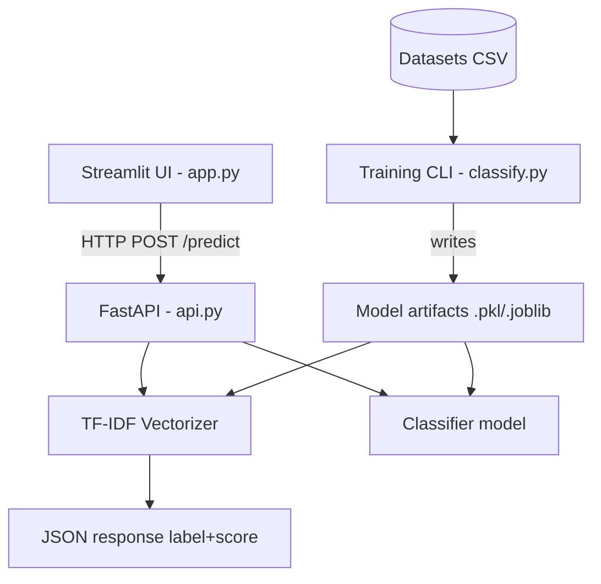
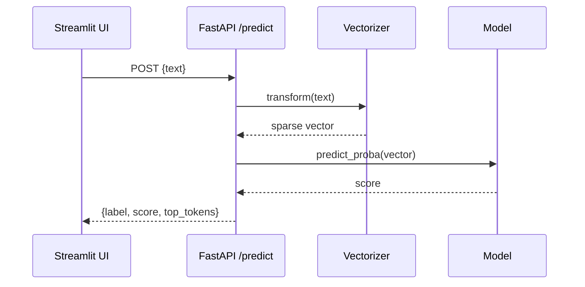
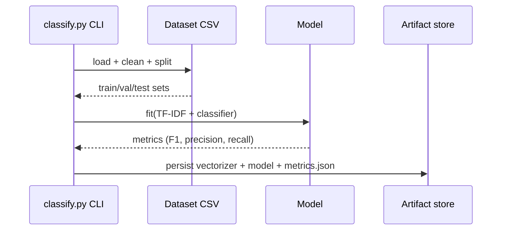
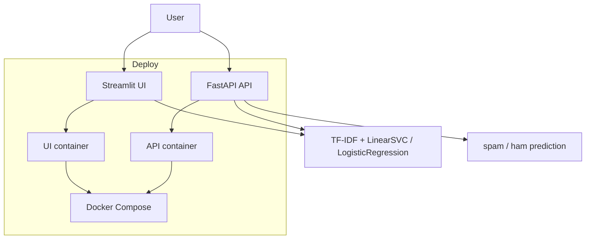

# TechSpec — Smart-Spam-Detector: Technical Specification

| Field | Value |
| --- | --- |
| Version | v0.1 |
| Last Updated | 2026-08-06 |
| Owner | Staff Engineer |
| Status | In Review |

---

## 1. Architecture Overview

## 2. Tech Stack Table

| Layer | Technology | Version | Justification |
| --- | --- | --- | --- |
| API server | FastAPI | ≥ 0.100 | Async, typed, auto OpenAPI docs |
| Web UI | Streamlit | ≥ 1.28 | Rapid interactive ML demos |
| ML features | scikit-learn (TF-IDF + LinearSVC/LogReg) | ≥ 1.3 | Proven, interpretable, fast |
| CLI/serving | Python (standard lib + click/argparse) | 3.9+ | Unified language across stack |
| Packaging | Docker + docker-compose | latest | Self-hostability (REQ-022) |
| Testing | pytest + httpx | latest | Unit + API contract tests |
| Linting | ruff (+ pre-commit) | latest | Consistent style, fast |

## 3. System Components

| Component | Responsibility | Inputs / Outputs | Scaling | Failure Modes |
| --- | --- | --- | --- | --- |
| FastAPI app (`api.py`) | Serve predictions, validate input | Message text → JSON verdict | Horizontal via replicas behind LB | Model artifact missing → 500 with clear error |
| Streamlit app (`app.py`) | Interactive classification UI | Form input → verdict display | Single instance; stateless | API down → friendly error banner |
| Training CLI (`classify.py`) | Train, evaluate, export | Dataset CSV → metrics + artifacts | Offline, batch | Bad data → validation error |
| Vectorizer + model | Text → probability | Text tokens → score | In-memory, per process | Version skew with training code |

## 4. Data Flow Diagrams

### 4.1 Single Prediction

### 4.2 Training Run

## 5. Third-Party Integrations

| Service | Purpose | Failure Fallback | Cost Model | Rate Limits |
| --- | --- | --- | --- | --- |
| None required at runtime | — | — | — | — |
| (Optional) Public spam datasets | Training data | User-supplied CSV | Free (license-dependent) | N/A |

## 6. Non-Functional Requirements

| Category | Requirement | Target Metric | How Verified |
| --- | --- | --- | --- |
| Performance | p95 prediction latency | < 200 ms | Load test / access logs |
| Availability | API uptime | ≥ 99.5% | Uptime monitor |
| Scalability | Concurrent requests | ≥ 100 req/s on 2 vCPU | Load test (k6/vegeta) |
| Security | No secrets in code | 0 secrets committed | pre-commit + scan |
| Observability | Request logs with latency | 100% of requests logged | Log review |

## 7. Environments

| Env | URL Pattern | Data Policy | Deploy Trigger | Access Control |
| --- | --- | --- | --- | --- |
| Dev | localhost:8000 / :8501 | Synthetic + sample data | Manual `uvicorn`/`streamlit run` | Local only |
| Staging | staging.example.com | Sample subset | CI on merge to main | Team |
| Prod | spam.example.com | Full | Tagged release | Team + optional API keys |

## 8. Error Handling Strategy

- Global error codes: `E400_INVALID_INPUT`, `E404_MODEL_NOT_FOUND`, `E500_INTERNAL`.
- Retry/backoff: client-side retry with exponential backoff (max 3) on 5xx.
- Idempotency: predictions are pure functions — safe to retry.
- Circuit breaker: N/A (no external dependencies); readiness probe checks artifact load.

## 9. Observability

- Structured JSON logs with request id, path, latency, label.
- `/health` endpoint for liveness; artifact version logged at startup.
- Dashboard: request rate, p50/p95 latency, label distribution, model version.

## 10. Technical Risks & Mitigations

| Risk | Mitigation |
| --- | --- |
| Model artifact/source version drift | Store model_version in artifact manifest; log at serve |
| Vocabulary mismatch after retraining | Reproducible pipeline pins seed + data snapshot |
| Dependency CVEs | Dependabot + pinned hashes where feasible |
| Slow vectorization at scale | Cache fitted vectorizer in memory; consider joblib mmap |

## Deployment Topology

## 11. Related Documents

| Document | Relationship |
| --- | --- |
| [PRD.md](../product/PRD.md) | Requirements and metrics this spec implements |
| [Schema.md](Schema.md) | Data model for datasets/artifacts/history |
| [API.md](API.md) | Exact endpoint contracts for `api.py` |
| [ImplementationPlan.md](../project/ImplementationPlan.md) | Tasks mapping to components above |
| [Testing.md](Testing.md) | How each component is tested |
| [Deployment.md](Deployment.md) | Docker/compose deployment topology |
| [SecurityAndCompliance.md](SecurityAndCompliance.md) | Threat model for the API surface |
